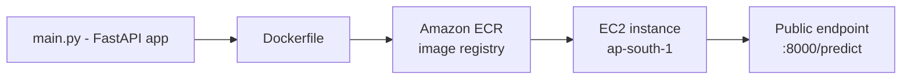

# AWS Deployment Guide — FastAPI + Docker + EC2

This document covers the second deployment path for this project: a containerized REST API served from AWS, alongside the Streamlit dashboard described in the main [README](README.md). The Streamlit app is built for interactive exploration; this path exists to demonstrate a production-style serving pattern — the same trained pipeline, wrapped as a stateless HTTP service.

---

## Table of Contents

- [Why a Second Deployment Path](#why-a-second-deployment-path)
- [Architecture](#architecture)
- [The FastAPI Wrapper](#the-fastapi-wrapper)
- [Containerizing with Docker](#containerizing-with-docker)
- [Pushing to Amazon ECR](#pushing-to-amazon-ecr)
- [Running on EC2](#running-on-ec2)
- [Production Hardening](#production-hardening)
- [Testing the Deployment](#testing-the-deployment)
- [Key Engineering Decisions](#key-engineering-decisions)
- [Cost Awareness](#cost-awareness)

---

## Why a Second Deployment Path

The Streamlit app is the right tool for interactive exploration — uploading a CSV, browsing SHAP charts, downloading results. It isn't, by itself, something another service could call programmatically. This path wraps the same trained pipeline (`models/xgboost_model.joblib`) in a stateless REST API instead — the shape a real production consumer (a backend service, a scheduled batch job, another team's system) would actually expect to integrate with.

## Architecture



Request flow at runtime:

```
Client --> POST /predict (raw customer JSON)
        --> Pydantic validation (CustomerInput)
        --> pipeline.predict() / predict_proba()
        --> JSON response (customer_id, churn_prediction, churn_probability)
```

## The FastAPI Wrapper (`main.py`)

- Loads `models/xgboost_model.joblib` once at startup (via FastAPI's `lifespan` context), not per-request — reloading a pickle on every call would add unnecessary latency.
- `CustomerInput` mirrors the raw Telco schema **exactly**, including `customerID`, `MonthlyCharges`, and `TotalCharges` — even though the trained pipeline's `ColumnTransformer` drops all three internally. sklearn's `ColumnTransformer` validates that every column referenced by any transformer (including ones mapped to `'drop'`) exists in the input at transform time; omitting them raises a `KeyError` before prediction ever runs.
- The response echoes `customer_id` back alongside the prediction, since a real caller sending a batch of customers needs to know which result belongs to which record.
- A `/health` endpoint exists purely for infrastructure — Docker's `HEALTHCHECK` and any future load balancer both need something cheap to poll that isn't the full prediction path.

## Containerizing with Docker

- Base image: `python:3.11-slim`. The full `python:3.11` image includes build tooling this project doesn't need; Alpine-based images tend to fight with the compiled wheels `scikit-learn` and `xgboost` ship, costing more debugging time than the image-size savings are worth.
- The image copies only `main.py`, `src/`, `requirements.txt`, and `models/` — not the Streamlit app, notebooks, or sample data. `.dockerignore` keeps those out of the build context entirely, which also speeds up every `docker build` (Docker uploads the full build context before looking at `COPY` lines, regardless of what's actually copied).
- **A real gotcha worth documenting:** the first build ran but crashed on startup with `ModuleNotFoundError: No module named 'src'`. The saved pipeline's `ColumnTransformer` includes a custom `FunctionTransformer` built from a function in `src/binary_map.py`. Pickle doesn't serialize that function's code — only a reference to where it's importable (`src.binary_map`). The Streamlit deployment never hit this because the whole repo, `src/` included, is always present alongside it. A minimal Docker image doesn't get that for free — `src/` has to be explicitly copied in, even though nothing in `main.py` calls it directly.
- `CMD` binds to `0.0.0.0`, not uvicorn's default of `127.0.0.1` — a container's loopback address isn't reachable from outside the container even with a port mapping in place.

## Pushing to Amazon ECR

1. An IAM user scoped to `AmazonEC2ContainerRegistryFullAccess` (not root credentials) authenticates the local CLI.
2. `aws ecr create-repository` creates the registry.
3. `docker tag` + `docker push` send the built image to `<account-id>.dkr.ecr.ap-south-1.amazonaws.com/churn-api`.

## Running on EC2

1. The EC2 instance (`t3.micro`, Amazon Linux 2023, `ap-south-1` — same region as the ECR repo, to avoid cross-region pulls) is launched with an **IAM instance role** (`AmazonEC2ContainerRegistryReadOnly`) attached, rather than placing long-lived AWS credentials on the box itself.
2. Security group allows inbound `22` (SSH, restricted to a specific IP) and `8000` (the API port, open for testing).
3. Docker is installed via `dnf`, the image is pulled from ECR, and run with `-d --restart unless-stopped` so it survives both SSH disconnects and instance reboots.

## Production Hardening

Three additions on top of the initial working deployment:

**Structured logging** — every request is logged (method, path, status code, duration), and every prediction logs the customer ID, the resulting label, and probability. Errors during prediction are logged with a full stack trace instead of failing silently. Logs go to stdout, which Docker/CloudWatch capture automatically — nothing is written to a file inside the container, since container filesystems are ephemeral.

**API key authentication** — `/predict` now requires an `X-API-Key` header matching an `API_KEY` environment variable set at container runtime (`docker run -e API_KEY=...`), never baked into the image. `/health` stays open intentionally, so load balancers and uptime checks can poll it without a key.

**Tests + CI/CD** — `tests/test_main.py` covers the basics: health check, missing/wrong API key rejected, a valid prediction returns a sane shape, and malformed input is rejected with a 422. `.github/workflows/ci-cd.yml` runs these tests on every push to `main` that touches the API, and only builds + pushes a new image to ECR if they pass. It intentionally stops at ECR — auto-redeploying onto EC2 would mean storing an SSH key as a GitHub secret, which is a deliberate future decision, not a default.

Another real gotcha found here: the tests passed locally with `python -m pytest`, then failed in CI with `ModuleNotFoundError: No module named 'main'` running the exact same command as plain `pytest`. `python -m pytest` adds the current directory to Python's import path automatically; a bare `pytest` invocation doesn't, and relies on its own rootdir-insertion logic instead, which doesn't reach the repo root here. Fixed with `PYTHONPATH=. pytest -v` in the workflow.

## Testing the Deployment

```bash
curl http://<ec2-public-ip>:8000/health
curl -X POST http://<ec2-public-ip>:8000/predict \
  -H "X-API-Key: <your-api-key>" \
  -H "Content-Type: application/json" \
  -d '{"customerID": "0000-TEST", ...}'
```

or open `http://<ec2-public-ip>:8000/docs` for the interactive Swagger UI and send a real prediction request.

## Key Engineering Decisions

- **EC2 over ECS/Fargate, for now:** a single container serving a single model doesn't need orchestration yet. ECS/Fargate is a reasonable next step if this needed to scale past one instance.
- **ECR over Docker Hub:** keeps the image, the registry, and the compute in the same cloud account and region, with IAM controlling access instead of a separate Docker Hub login.
- **Instance role over static credentials:** the EC2 instance never stores an AWS access key; temporary credentials are issued automatically through the attached role — more secure, and one less secret to rotate or leak.

## Cost Awareness

The EC2 instance (and any attached resources, like an Elastic IP if added later) accrues charges for as long as it runs, independent of actual request volume. Stop the instance from the EC2 console when it isn't actively being demonstrated or tested.
