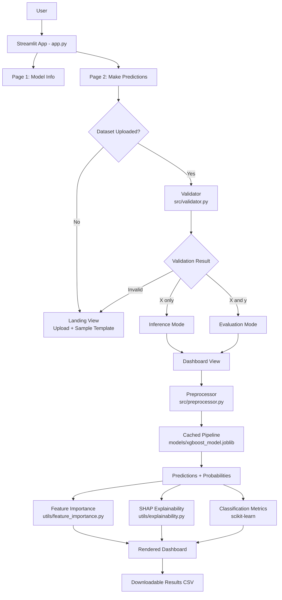

# Customer Churn Prediction — XGBoost + Streamlit

A production-style machine learning application that predicts telecom customer churn. The project covers the full pipeline: data cleaning, leak-aware preprocessing, model tuning, and a deployed interactive dashboard that automatically adapts based on whether ground-truth labels are available.

**Live demo:** https://xgboost-classifier-for-customer-churn-ayush-devadiga.streamlit.app/

---

## Table of Contents

- [Overview](#overview)
- [Architecture](#architecture)
- [Project Structure](#project-structure)
- [Module Breakdown](#module-breakdown)
- [Model Details](#model-details)
- [Results](#results)
- [Running Locally](#running-locally)
- [Key Engineering Decisions](#key-engineering-decisions)
- [Limitations](#limitations)

---

## Overview

Customer churn — when a subscriber leaves a service — is expensive to recover from after the fact and far cheaper to prevent. This project trains a classifier on the IBM Telco Customer Churn dataset (7,043 customers, 21 attributes) to flag customers who are likely to leave, so a business could act on that signal before losing them.

The project has two halves:

1. **Model training** (`eda/`) — exploratory analysis, feature selection reasoning, a leak-safe preprocessing pipeline, and hyperparameter tuning across XGBoost, LightGBM, and CatBoost.
2. **Deployed application** (everything else) — a multi-page Streamlit app where a user can either explore how the model was built and evaluated, or upload their own data (with or without labels) and get predictions, feature explanations, and a downloadable results file.

---

## Architecture

### Mermaid diagram



### ASCII fallback

```
                              +-------------------+
                              |     User Input     |
                              +---------+-----------+
                                        |
                                        v
                          +-------------------------+
                          |   Streamlit App Shell    |
                          |        (app.py)          |
                          +-----+---------------+-----+
                                |               |
                                v               v
                  +---------------------+   +--------------------------+
                  |  Page 1: Model Info |   | Page 2: Make Predictions |
                  +---------------------+   +-------------+------------+
                                                           |
                                                           v
                                              +-------------------------+
                                              |    Landing View         |
                                              | (upload / sample CSV)   |
                                              +------------+------------+
                                                           |
                                                           v
                                              +-------------------------+
                                              |  Validator              |
                                              |  src/validator.py       |
                                              +------------+------------+
                                                           |
                                  +------------------------+------------------------+
                                  |                                                 |
                                  v                                                 v
                       +-------------------+                          +--------------------------+
                       |  X only (infer)   |                          |  X + y (evaluate)        |
                       +---------+---------+                          +-------------+------------+
                                  |                                                 |
                                  +------------------------+------------------------+
                                                           |
                                                           v
                                              +-------------------------+
                                              |     Dashboard View      |
                                              +------------+------------+
                                                           |
                                                           v
                                              +-------------------------+
                                              |  Preprocessor            |
                                              |  src/preprocessor.py    |
                                              +------------+------------+
                                                           |
                                                           v
                                              +-------------------------+
                                              |  Cached ML Pipeline      |
                                              |  models/xgboost_model   |
                                              |       .joblib            |
                                              +------------+------------+
                                                           |
                              +----------------------------+----------------------------+
                              |                            |                            |
                              v                             v                            v
                   +-------------------+       +-------------------------+   +-----------------------+
                   | Feature           |       | SHAP Explainability    |   | Classification Metrics |
                   | Importance        |       | utils/explainability.py|   | (confusion matrix, etc)|
                   +-------------------+       +-------------------------+   +-----------------------+
                              |                            |                            |
                              +----------------------------+----------------------------+
                                                           |
                                                           v
                                              +-------------------------+
                                              |   Rendered Dashboard     |
                                              |   + Downloadable CSV     |
                                              +-------------------------+
```

---

## Project Structure

```
xgbc-customer-churn/
├── app.py                          # Entry point — landing page, sidebar navigation
├── pages/
│   ├── 1_model_info.py             # How the model was trained and evaluated
│   └── 2_make_predictions.py       # Upload data, get predictions
├── frontend/
│   ├── main_page/                  # Markdown content for the home page
│   ├── page_1/                     # Markdown + saved plots for model info page
│   └── page_2/
│       ├── views/
│       │   ├── landing_view.py     # Upload UI, sample CSV, validation trigger
│       │   └── dashboard_view.py   # Results dashboard (metrics, SHAP, export)
│       └── introduction.md
├── src/
│   ├── validator.py                # Schema validation, X-only vs X+y detection
│   ├── preprocessor.py             # Pipeline loading, prediction generation
│   └── binary_map.py               # Shared Yes/No-style binary mapping function
├── utils/
│   ├── feature_importance.py       # XGBoost native feature importance
│   ├── feature_transformer.py      # Recovers readable column names post-transform
│   ├── predict_proba.py            # Probability extraction helper
│   └── explainability.py           # SHAP value computation
├── eda/
│   ├── CustomerChurnOnTelco.ipynb            # Initial EDA and manual preprocessing
│   └── CustomerChurnOnTelcoPipelined.ipynb   # Final leak-safe pipeline + tuning
├── models/
│   └── xgboost_model.joblib        # Trained, tuned pipeline (preprocessor + model)
├── graphs/                         # Saved evaluation plots used in Page 1
└── requirements.txt
```

---

## Module Breakdown

**`app.py`**
The landing page. Loads the introduction markdown and sets up sidebar navigation. No business logic lives here — it only renders content and routes to the two pages.

**`pages/1_model_info.py`**
A static dashboard explaining how the model was trained: dataset schema, correlation heatmap, confusion matrix, ROC curve, and the classification report from the held-out test set. This page answers "how good is the model and why should I trust it."

**`pages/2_make_predictions.py`**
The entry point for the interactive part of the app. Tracks session state (`dataset_approved`, `processed_data`, `data_status`) and routes between the landing view (no data yet) and the dashboard view (data validated and ready).

**`src/validator.py`**
Validates an uploaded CSV against the expected schema — checks column names, data types, and missing values. It also automatically detects whether the upload contains only features (`X_ONLY`, for pure inference) or features plus a `Churn` column (`X_AND_Y`, for evaluation against ground truth). This single function decides which mode the rest of the app runs in.

**`src/preprocessor.py`**
Loads the trained pipeline from disk (cached with `st.cache_resource` so it only loads once per session), and provides helper functions to generate predictions and extract the true labels when present.

**`src/binary_map.py`**
A single shared function that maps Yes/No-style categorical values (including gender, internet service flags, etc.) to 0/1. This function is also used directly inside the trained pipeline's `FunctionTransformer`, so it has to live in an importable module rather than a notebook cell — otherwise the saved model cannot be unpickled outside the notebook that created it.

**`utils/feature_importance.py`**
Pulls XGBoost's built-in `feature_importances_` and pairs them with readable column names for the global importance chart.

**`utils/feature_transformer.py`**
The trained pipeline's preprocessing step (`ColumnTransformer`) does not always return clean, human-readable column names — particularly when custom transformers are involved. This module reconstructs sensible feature names so importance and SHAP charts are interpretable rather than showing raw array indices.

**`utils/explainability.py`**
Computes SHAP values using `TreeExplainer` and aggregates them into a ranked DataFrame, giving a model-agnostic, theoretically grounded view of which features drive predictions — complementary to the XGBoost native importance, which can be biased toward high-cardinality features.

**`frontend/page_2/views/landing_view.py`**
Handles file upload, offers a downloadable sample CSV so users know the expected format, and triggers validation. On success, it updates session state and reruns the app into dashboard mode.

**`frontend/page_2/views/dashboard_view.py`**
The main results screen. Branches its entire layout based on whether labels are present: shows evaluation metrics (classification report, confusion matrix, SHAP, tenure trend) when ground truth exists, or a simpler inference-only view (prediction distribution, feature importance) when it doesn't. Also handles exporting results as a downloadable CSV.

---

## Model Details

- **Algorithm:** XGBoost Classifier, selected after comparing against LightGBM, CatBoost, and a Random Forest baseline
- **Dataset:** IBM Telco Customer Churn (Kaggle) — 7,043 customers, 21 original features
- **Preprocessing:**
  - Binary mapping for Yes/No-style categorical columns (including gender)
  - Ordinal encoding for `Contract` (reflects a natural order: month-to-month → one year → two year)
  - Target encoding for `InternetService` and `PaymentMethod`
  - `MonthlyCharges`, `TotalCharges`, and `customerID` dropped — `TotalCharges` is largely redundant with `tenure` x `MonthlyCharges`, and `customerID` carries no signal
- **Class imbalance:** handled via `scale_pos_weight`, calculated from the training split only (not the full dataset) to avoid leakage
- **Tuning:** `RandomizedSearchCV` (20 iterations, 5-fold cross-validation, optimized for ROC-AUC)
- **Explainability:** both native XGBoost feature importance and SHAP values are available in the app

---

## Results

| Metric | Class 0 (Retained) | Class 1 (Churned) |
|---|---|---|
| Precision | 0.91 | 0.51 |
| Recall | 0.73 | 0.79 |
| F1-Score | 0.81 | 0.62 |

**Cross-validated ROC-AUC:** ~0.85
**Test set ROC-AUC:** ~0.83

Recall on the churned class is prioritized over precision — in a retention use case, missing an actual churner (false negative) is costlier than flagging a loyal customer for a retention offer they didn't need (false positive).

---

## Running Locally

```bash
git clone <repo-url>
cd xgbc-customer-churn
python -m venv .venv
.venv\Scripts\activate        # Windows
pip install -r requirements.txt
streamlit run app.py
```

---

## Key Engineering Decisions

- **Leak-aware preprocessing:** class weights and target encoding statistics are computed strictly from the training split, never the full dataset, and each model pipeline uses a `clone()` of the shared preprocessor to avoid shared fitted state between experiments.
- **Dual-mode dashboard:** the same dashboard code path serves two real use cases — bulk inference on new, unlabeled data (production-like) and evaluation against known outcomes (model validation) — without duplicating UI code.
- **Pickling-safe custom transformers:** the binary-mapping function used inside the pipeline lives in its own importable module rather than inline in the training notebook, so the saved pipeline can be loaded from any process, including the deployed app, without errors.
- **Cached resources:** the trained pipeline is loaded once per session (`st.cache_resource`), not on every interaction, to keep the app responsive.

---

## Limitations

- The dataset is a static snapshot — there is no real-time or time-series customer behavior data, so the model cannot detect gradual behavioral drift, only the attributes present at a single point in time.
- Class imbalance handling improves recall on churners but trades off some precision; in a real deployment, the decision threshold would be tuned against the actual cost of a missed churner versus an unnecessary retention offer.
- SHAP computation runs on the uploaded dataset at request time rather than being precomputed, so very large uploads may be slower to render.
